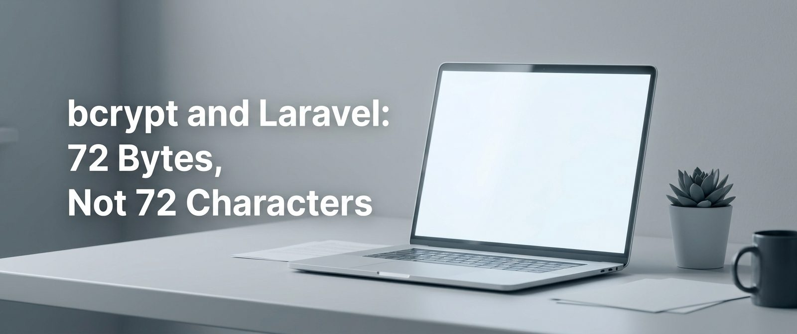

# bcrypt and Laravel: 72 Bytes, Not 72 Characters

I expected bcrypt to silently drop characters past 72. I did not expect it to bake in half an emoji.

The original password still verifies. But strip the emoji, or let a password manager omit it, and you're locked out. Your Laravel validator passed it as valid the whole time.

## What's Inside

- Why bcrypt's 72-byte limit hits Cyrillic, CJK, and emoji users much harder than ASCII users
- The split-byte trap: what happens when the byte boundary lands inside a multi-byte character
- PHP 8.4 sandbox results showing exactly which inputs verify and which don't
- Why `Password::max(72)` doesn't actually protect you (it uses `mb_strlen`, not `strlen`)
- Laravel 12's `BCRYPT_LIMIT` config: what it does and what it misses
- Three fix options: byte-length validator, Argon2id migration, HMAC-SHA-256 pre-hashing

## Read Full

[bcrypt and Laravel: 72 Bytes, Not 72 Characters](https://dev.to/tegos/bcrypt-and-laravel-72-bytes-not-72-characters-3jb1)
